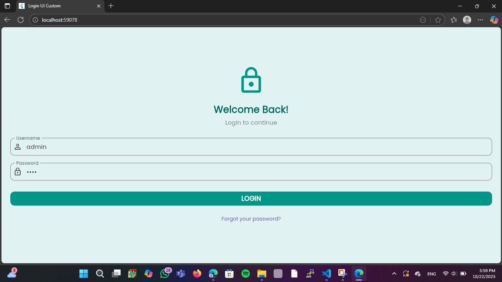
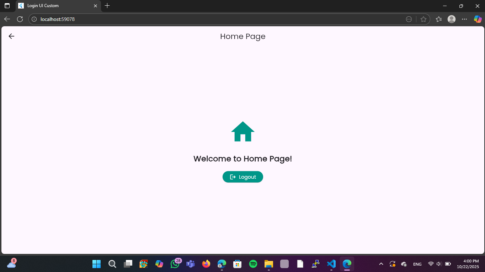

# Login UI Custom - Flutter

Aplikasi login sederhana dengan desain custom menggunakan Flutter dan Dart.

## 📱 Fitur
- ✅ Login UI dengan tema Teal
- ✅ Font custom menggunakan Google Fonts (Poppins)
- ✅ Validasi login
- ✅ Navigasi ke halaman home
- ✅ Tombol logout
- ✅ Notifikasi error dengan SnackBar

## 📸 Screenshot

### Login Page


### Home Page


## 🚀 Cara Menjalankan

1. Clone repository ini:
```bash
git clone https://github.com/galihr15/login-ui-flutter.git
```

2. Masuk ke folder project:
```bash
cd login-ui-flutter
```

3. Install dependencies:
```bash
flutter pub get
```

4. Jalankan aplikasi:
```bash
flutter run
```

## 🔐 Kredensial Login
- **Username**: admin
- **Password**: 1234

## 🛠️ Teknologi
- Flutter
- Dart
- Google Fonts (Poppins)

## 👥 Anggota Kelompok
- Galih Rahayu
- Ihsan Mubarox
- Bayu Prasetyo
- Taufik Irfan Septian

## 📝 Tugas
Tugas Pemrograman Mobile - Membuat Login UI Custom

---
⭐ Jika bermanfaat, berikan star pada repository ini!